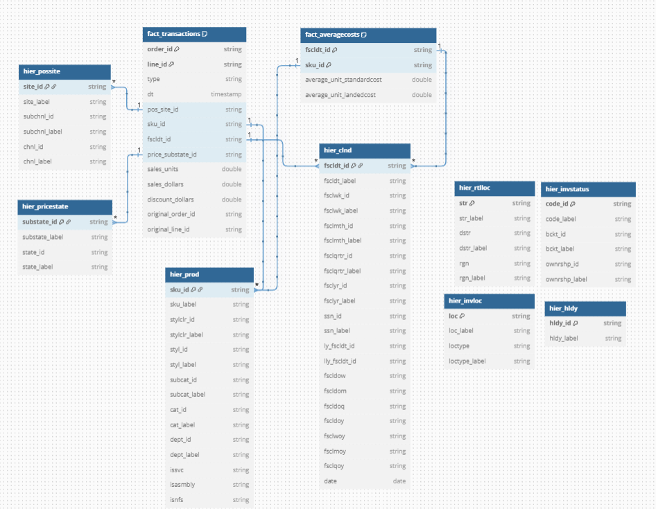
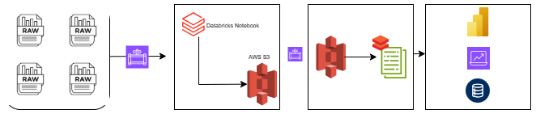

# GS-DE-Challenge

This repo contains my solution to the GSynergy Databricks Data Engineer Challenge. 

It showcases a complete ETL pipeline using PySpark and Delta Lake on Databricks, covering ingestion, cleaning, validation, transformation, aggregation, and incremental loading—all in one notebook.

## Table of Contents

- [Project Overview](#project-overview)
- [Repository Structure](#repository-structure)
- [Setup Instructions](#setup-instructions)
- [Execution Instructions](#execution-instructions)
- [Diagrams](#diagrams)
- [Video Demonstration](#video-demonstration)

## Project Overview

This solution reads raw pipe-delimited .dlm files from DBFS, transforms them into clean Delta tables in a staging layer, and calculates aggregated metrics into a final table mview_weekly_sales in the refined layer. Incremental updates are handled using Delta Lake's merge. All logic is implemented in a single notebook: **GS_PySpark_AWS_ETL_with_Incremental.ipynb**.

## Repository Structure

```
GS-DE-Challenge/
│
├── README.md
│
├── notebook/
│   └── GS_PySpark_AWS_ETL_with_Incremental.ipynb
│
└── diagram/
    ├── ER Diagram.png     
    └── data_flow.drawio.png
```

## Setup Instructions

1. **Clone the Repository:**
   ```bash
   git clone https://github.com/devanshu-talk/GS-DE-Challenge.git
   ```

2. **Databricks Environment:**
   - Upload the contents of the `notebooks/` folder to your Databricks workspace.
   - Ensure that your raw data files are located at `dbfs:/FileStore/gs/` (or update the BASE_PATH in the notebook accordingly).

3. **Dependencies:**
   - The solution uses PySpark and Delta Lake which are pre-installed in Databricks.

## Execution Instructions

1. **Run the Notebook:**
   - Open `notebooks/GS_PySpark_AWS_ETL_with_Incremental.ipynb` in your Databricks workspace.
   - Execute all cells sequentially to:
     - Ingest raw data,
     - Validate and clean data,
     - Write cleaned data to staging Delta tables,
     - Create the refined aggregated table (`mview_weekly_sales_enriched`), and
     - Apply incremental update logic.

2. **Verify Results:**
   - You can use a SQL cell or the Databricks SQL Editor to query the final refined table:
     ```sql
     SELECT * FROM mview_weekly_sales_enriched LIMIT 20;
     ```

## Diagrams

### ER Diagram

The ER diagram shows all tables with full column details, primary keys (PK), and foreign key (FK) relationships.



### Dataflow Diagram

The dataflow diagram illustrates the movement of data from raw ingestion through staging to the refined layer, including incremental updates.




© Devanshu Jain
